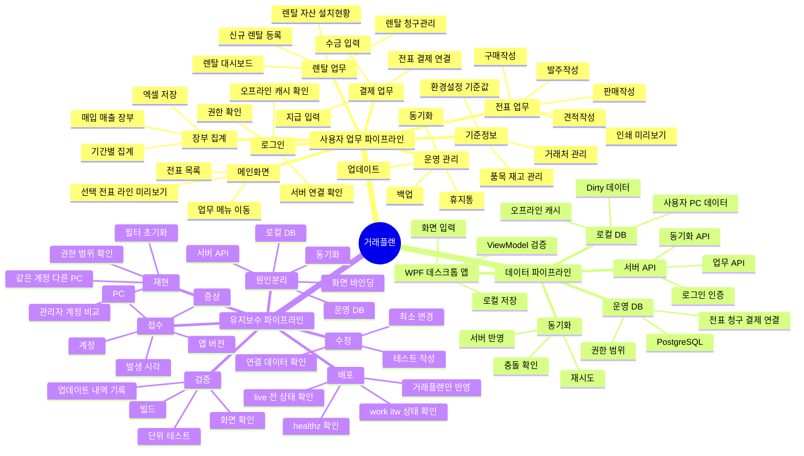
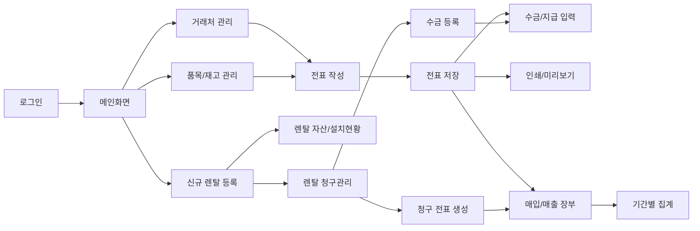
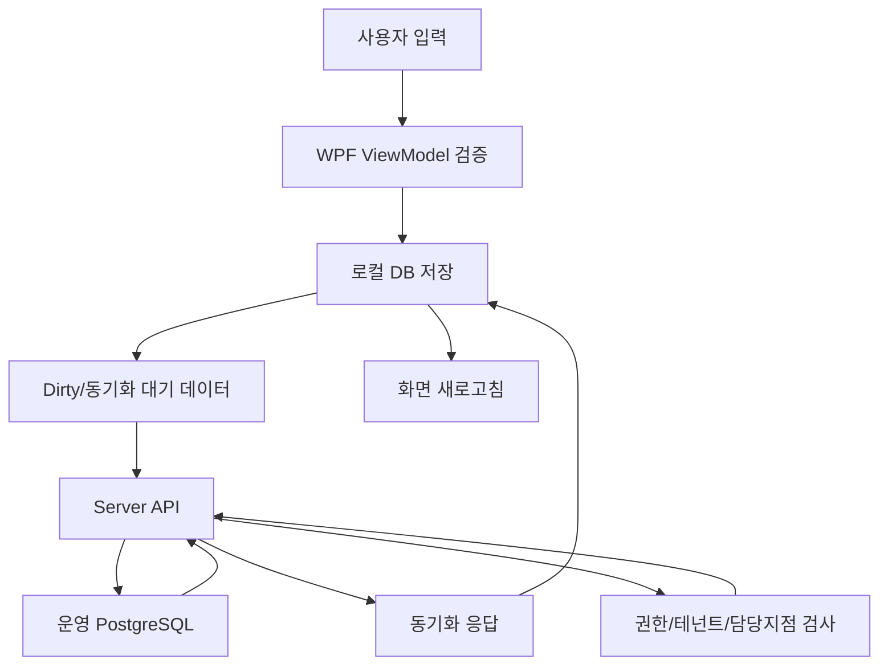
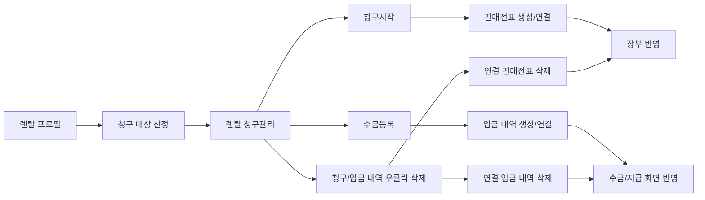
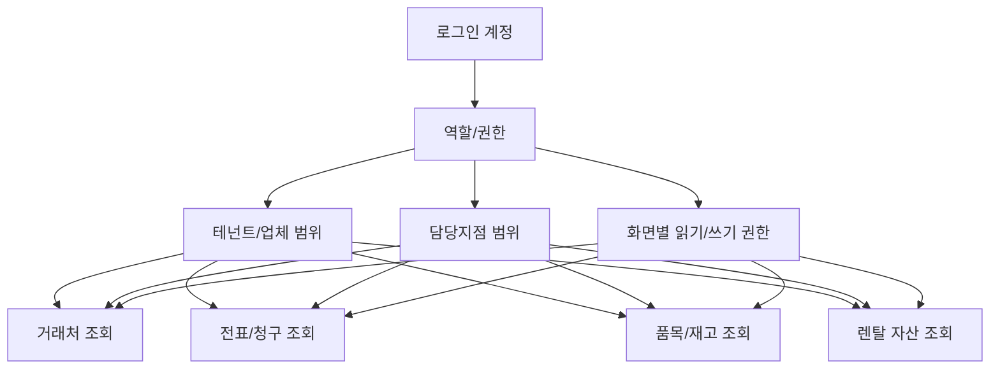
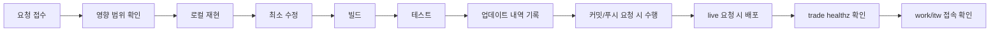
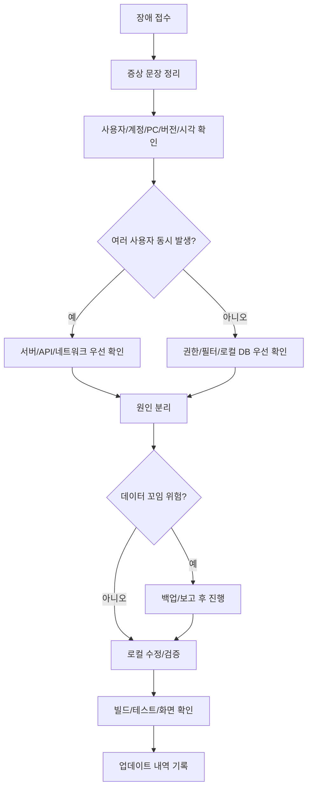
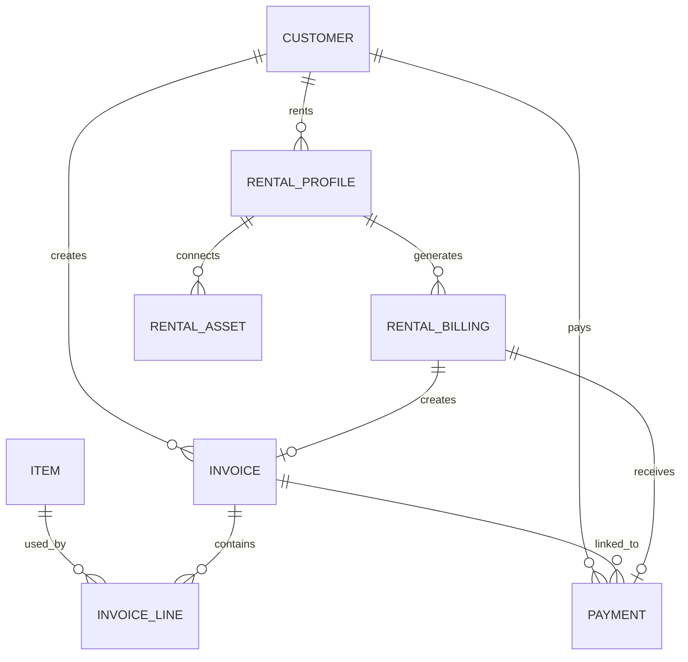

# 거래플랜 파이프라인 마인드맵

> Obsidian에서 이 파일을 열고 Preview 모드로 보면 Mermaid 마인드맵과 파이프라인 흐름도를 바로 확인할 수 있습니다.  
> 관련 문서: [[README]], [[사용 메뉴얼]], [[거래플랜 사용자 메뉴얼]], [[업데이트 내역]]

## 1. 전체 마인드맵



## 2. 사용자 업무 파이프라인



### 업무 흐름 핵심

| 단계 | 화면 | 핵심 데이터 | 유지보수 확인 포인트 |
|---|---|---|---|
| 1 | 로그인 | 계정, 권한, 서버 연결 | 서버 오류와 비밀번호 오류를 분리 |
| 2 | 메인화면 | 전표 목록, 선택 전표 라인 | 실제 전표 상세 순서와 미리보기 순서 일치 |
| 3 | 거래처 관리 | 거래처, 거래구분, 담당지점 | 담당지점/권한 범위 때문에 안 보일 수 있음 |
| 4 | 품목/재고 관리 | 품목, 단가, 재고방식, 창고 | 품목 범위와 자산/청구 범위를 혼동하지 않기 |
| 5 | 전표 작성 | 판매/구매/견적/발주, 라인, 금액 | 저장 순서, 라인 정렬, 인쇄 미리보기 확인 |
| 6 | 수금/지급 | 결제일, 결제수단, 금액, 연결 전표 | 결제 삭제 시 장부와 전표 상태 영향 |
| 7 | 장부/집계 | 기간, 거래처, 전표, 결제 | 기간/필터/권한 확인 후 금액 검증 |
| 8 | 렌탈 | 청구 프로필, 자산, 청구, 입금 | 청구/입금 삭제 시 연결 전표/입금 동시 삭제 |

## 3. 데이터 동기화 파이프라인



### 동기화 점검 순서

1. 화면에서 저장이 성공했는지 확인합니다.
2. 로컬 DB에 변경이 반영됐는지 확인합니다.
3. Dirty 데이터가 남아 있는지 확인합니다.
4. 서버 API 호출이 성공했는지 확인합니다.
5. 운영 DB에 반영됐는지 확인합니다.
6. 다른 PC나 다른 계정에서 같은 데이터가 조회되는지 확인합니다.

> 중요: 로컬 저장 성공과 서버 반영 성공은 같은 의미가 아닙니다.

## 4. 렌탈 청구/입금 파이프라인



### 렌탈 삭제 시 확인할 것

- 청구월과 기준일이 맞는가?
- 거래처와 청구 거래처가 같은가, 다른가?
- 연결 판매전표 번호가 있는가?
- 연결 수금/입금 내역이 있는가?
- 삭제 후 장부, 수금/지급, 전표 목록에서 함께 사라지는가?
- 휴지통 또는 삭제 차단 사유가 필요한 구조인가?

## 5. 권한/범위 파이프라인



### 범위 혼동 방지

| 범위 | 확인 대상 | 주의점 |
|---|---|---|
| 거래처 범위 | 거래처 관리, 전표 거래처 | 담당지점 때문에 거래처가 안 보일 수 있음 |
| 품목 범위 | 품목/재고, 전표 품목 검색 | 창고/운영유형/재고방식과 연결 |
| 전표 범위 | 판매/구매/견적/발주, 장부 | 거래처와 담당지점 기준 확인 |
| 청구 범위 | 렌탈 청구관리 | 청구 거래처와 설치처가 다를 수 있음 |
| 자산 범위 | 렌탈 자산/설치현황 | 현재 거래처와 청구 거래처를 분리 |
| 권한 저장 | 환경설정, 사용자 관리 | 읽기 가능과 쓰기 가능을 분리 |

## 6. 개발/배포 파이프라인



### 기본 명령

```powershell
D:\거래플랜\.dotnet\dotnet.exe build D:\거래플랜\거래플랜.sln -c Debug
D:\거래플랜\.dotnet\dotnet.exe test D:\거래플랜\Tests\GeoraePlan.Desktop.App.Tests\GeoraePlan.Desktop.App.Tests.csproj
D:\거래플랜\.dotnet\dotnet.exe test D:\거래플랜\Tests\GeoraePlan.Server.Api.Tests\GeoraePlan.Server.Api.Tests.csproj
```

### live 반영 안전 규칙

- 한 번에 거래플랜, 워크플랜, itw 홈페이지를 섞어서 수정/배포/재시작하지 않습니다.
- live 반영 전에는 `trade.2884.kr`, `work.2884.kr`, `itw.2884.kr` 접속 상태를 확인합니다.
- Docker 전체 재시작/정리 명령은 사용하지 않습니다.
- 필요한 경우 거래플랜 compose project 안에서 명시 서비스만 대상으로 작업합니다.
- live 반영 후에도 세 서비스 접속 상태를 다시 확인합니다.

## 7. 장애 대응 파이프라인



### 증상별 첫 확인

| 증상 | 먼저 확인 | 다음 확인 |
|---|---|---|
| 서버가 안 열림 | API healthz, 네트워크, 인증서 | 리버스 프록시, Docker API, DB |
| 거래처가 안 보임 | 검색어, 거래구분, 담당지점 | 휴지통, 권한, 동기화 |
| 품목이 안 보임 | 품목 상태, 창고, 담당지점 | 운영유형, 재고방식, 권한 |
| 전표 라인 순서가 다름 | 실제 전표 상세 순서 | 메인 미리보기, 인쇄 미리보기 |
| 수금/지급이 안 맞음 | 연결 전표, 금액, 결제일 | 부분결제, 삭제/복원, 동기화 |
| 렌탈 청구 삭제 영향 | 연결 판매전표, 연결 입금 | 장부/수금 화면, 휴지통 |

## 8. 핵심 데이터 관계



### 엔터티 설명

| 엔터티 | 의미 | 연결 |
|---|---|---|
| CUSTOMER | 거래처 | 전표, 수금/지급, 렌탈, 계약서의 기준 |
| ITEM | 품목 | 전표 라인, 렌탈 청구항목, 재고의 기준 |
| INVOICE | 전표 | 판매/구매/견적/발주와 장부 집계 기준 |
| INVOICE_LINE | 전표 라인 | 품목, 수량, 단가, 공급가, 부가세, 합계 |
| PAYMENT | 수금/지급 | 전표 결제 상태와 장부에 영향 |
| RENTAL_PROFILE | 렌탈 청구 프로필 | 청구 주기, 금액, 청구 거래처, 자산 연결 |
| RENTAL_ASSET | 렌탈 자산 | 관리번호/기계번호/설치처/상태 |
| RENTAL_BILLING | 렌탈 청구/입금 내역 | 판매전표와 입금 내역 생성/연결 |

## 9. 유지보수자가 외워야 할 기준

1. 화면에서 안 보이는 데이터는 삭제보다 먼저 권한, 담당지점, 필터, 동기화를 확인합니다.
2. 전표 라인 순서는 실제 전표 상세 화면을 기준으로 미리보기와 인쇄물을 맞춥니다.
3. 렌탈 청구/입금 내역 삭제는 연결 판매전표/입금 내역까지 영향을 줄 수 있습니다.
4. 자산 조회 범위, 품목 범위, 청구/전표 범위, 테넌트 범위는 서로 다를 수 있습니다.
5. 저장 성공과 서버 반영 성공을 분리해서 봅니다.
6. 운영 DB 수정 전에는 백업, 연결 데이터, 복구 방법을 먼저 정리합니다.
7. 파일을 수정하거나 산출물을 만들면 [[업데이트 내역]]에 반드시 append 방식으로 기록합니다.

